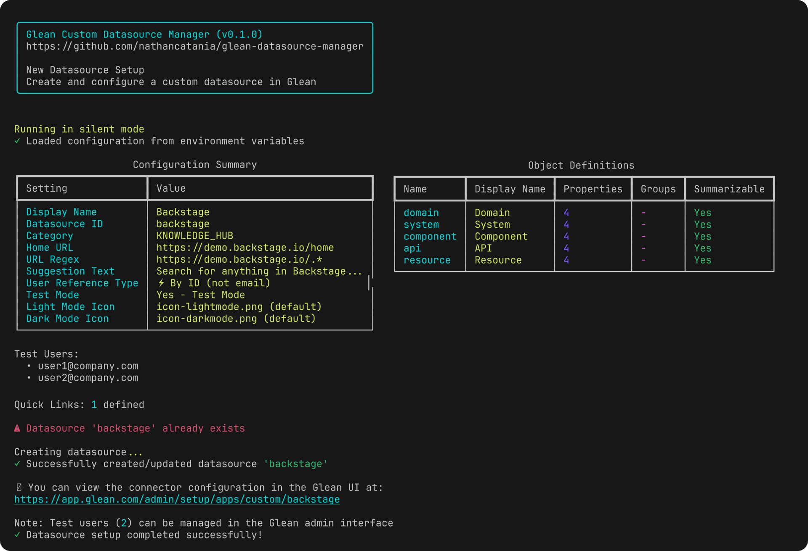
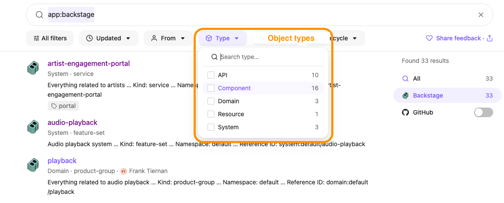
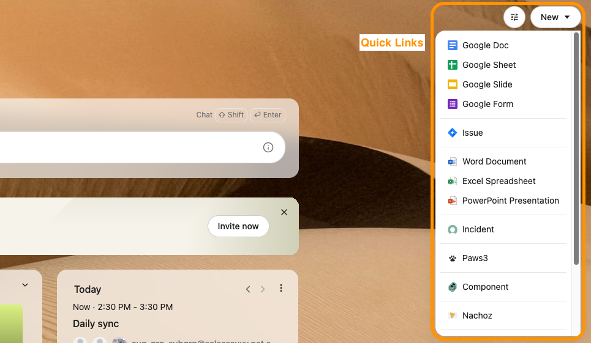

# Glean Custom Datasource Manager CLI

[](https://www.python.org/downloads/)
[](LICENSE)
[](https://github.com/astral-sh/uv)

A self-contained Python script for creating and managing custom datasources in Glean.

This tool provides both interactive and automated modes for datasource setup, configuration export/import, and template generation.



If you have [uv](https://github.com/astral-sh/uv) installed, you can immediately run the CLI without downloading anything - no dependency installation steps required!
```bash
uv run https://raw.githubusercontent.com/nathancatania/glean-datasource-manager/refs/heads/main/manage.py

Usage: manage.py [OPTIONS] COMMAND [ARGS]...

  Glean Custom Datasource Management Tool.

  Manage Glean custom datasources with commands for setup, configuration, and
  templates.

Options:
  -v, --version  Show the version and exit.
  --help         Show this message and exit.

Commands:
  check-categories              Show available datasource categories.
  config                        Fetch datasource configuration from Glean.
  generate-example-env          Generate an example .env.setup.example file.
  generate-object-template      Generate a sample object_types.json...
  generate-quicklinks-template  Generate a sample quick_links.json template.
  setup                         Setup a new Glean datasource.
```

## Disclaimer

> [!NOTE]
>
> This project is not affiliated with Glean.

This is a personal project created and published to assist in the automation of configuring datasources in Glean.

You use this tool at your own risk!
If it somehow deletes all of your company's data, burns down your house, and nukes your dog from orbit - it will be your own fault.

*That being said, I don't recall adding any code that would do this...* 🤷‍♂️

## TOC
- [Prerequisites](#prerequisites)
- [Quick Start](#quick-start)
- [Commands](#commands)
  - [`setup` - Create or Update a Datasource](#setup---create-or-update-a-datasource)
  - [`config` - View and Export Datasource Configuration](#config---view-and-export-datasource-configuration)
  - [`generate-object-template` - Create Object Types Template](#generate-object-template---create-object-types-template)
  - [`generate-quicklinks-template` - Create Quick Links Template](#generate-quicklinks-template---create-quick-links-template)
  - [`generate-example-env` - Create Environment File Template](#generate-example-env---create-environment-file-template)
  - [`check-categories` - List Datasource Categories](#check-categories---list-datasource-categories)
- [Environment Variables](#environment-variables)
  - [View/Export Datasource Config](#viewexport-datasource-config)
  - [Setup New Datasource/Push Config](#setup-new-datasourcepush-config)
- [Configuration Files](#configuration-files)
  - [Icons](#icons)
  - [`object_types.json`](#object_typesjson)
  - [`quick_links.json` (Optional)](#quick_linksjson-optional)
- [Example Workflows](#example-workflows)
  - [1. First-Time Setup of New Datasource](#1-first-time-setup-of-new-datasource)
  - [2. Automated Deployment](#2-automated-deployment)
  - [3. Backup and Restore Configuration](#3-backup-and-restore-configuration)
  - [4. Testing with Limited Users](#4-testing-with-limited-users)
- [Tips](#tips)
- [Troubleshooting](#troubleshooting)
- [After Setup](#after-setup)

## Prerequisites

### Install uv

This script uses [uv](https://github.com/astral-sh/uv) for Python package management:

```bash
# macOS
brew install uv

# Linux
curl -LsSf https://astral.sh/uv/install.sh | sh

# Windows
powershell -c "irm https://astral.sh/uv/install.ps1 | iex"
```

### Python Version

- Requires Python 3.13 or later

## Quick Start

1. Set the `GLEAN_INDEXING_API_KEY` and `GLEAN_INSTANCE_NAME` ENVs
   * Copy `.env.setup.example` and populate them, OR
   * Export them directly, e.g. `export GLEAN_INDEXING_API_KEY=.....`
   * Link: [Creating Indexing API Tokens (developers.glean.com)](https://developers.glean.com/api-info/indexing/authentication/overview#creating-indexing-api-tokens)
   * Link: [Finding your Instance Name (developers.glean.com)](https://developers.glean.com/get-started/authentication#how-to-find-your-instance)
  
> [!TIP]
> If your custom connector has an ID of `backstage`, then the API key must have the scope of `backstage` as well.

> [!TIP]
> The **Glean Instance Name** is the value to the right of the Glean Backend Domain for your environment.<br>E.g. If your domain is `mycompany-prod-be.glean.com`, then your Instance Name is `mycompany-prod`.


2. To setup a *new* custom connector, you will also need to populate `GLEAN_DATASOURCE_ID`, `GLEAN_DATASOURCE_DISPLAY_NAME` and `GLEAN_DATASOURCE_HOME_URL` variables. For information on these, see the [Environment Variables](#environment-variables) section below.

3. You can either download the `manage.py` script on it's own, or just point uv to the script on GitHub directly:

   ```bash
   # Run the script (shows help)
   uv run manage.py

   # Run the script without downloading it
   uv run https://raw.githubusercontent.com/nathancatania/glean-datasource-manager/refs/heads/main/manage.py

   # Read config of custom datasource from Glean
   uv run manage.py config <datasource_id>

   # Export config for a custom datasource from Glean
   # 💡 Tip: You can push this again to Glean using the 'setup' commands above!
   uv run manage.py config <datasource_id> --save

   # Interactive setup (recommended for first-time users)
   uv run manage.py setup

   # Silent setup (no confirmation prompts)
   uv run manage.py setup --silent
   ```

## Commands

### `setup` - Create or Update a Datasource

Interactive or automated datasource creation.

```bash
# Interactive mode (default)
uv run manage.py setup

# Silent mode - no prompts, uses environment variables
uv run manage.py setup --silent

# Force overwrite existing datasource (requires --silent)
uv run manage.py setup --silent --force
```

### `config` - View and Export Datasource Configuration

Fetch configuration from an existing Glean datasource.

```bash
# View configuration
uv run manage.py config <datasource_id>

# Export configuration to files
uv run manage.py config <datasource_id> --save
```

When using `--save`, creates a directory called `<datasource_id>-config` containing:
- `<datasource_id>.env` - Environment configuration
- `object_types.json` - Object type definitions (if any)
- `quick_links.json` - Quick link definitions (if any)
- Icon files (extracted from data URLs)

This configuration can be immediately restored by using the `setup` command from within the directory containing the exported config. Just add the `GLEAN_INDEXING_API_KEY` to the `<datasource_id>.env` that was created.

### `generate-object-template` - Create Object Types Template

Generate a sample `object_types.json` file with examples.

```bash
uv run manage.py generate-object-template
```

### `generate-quicklinks-template` - Create Quick Links Template

Generate a sample `quick_links.json` file with examples.

```bash
uv run manage.py generate-quicklinks-template
```

### `generate-example-env` - Create Environment File Template

Generate a `.env.setup.example` file with all available variables.

```bash
uv run manage.py generate-example-env
```

### `check-categories` - List Datasource Categories

Display available Glean datasource categories and their descriptions.

```bash
uv run manage.py check-categories
```

## Environment Variables

### View/Export Datasource Config

#### Required Variables

| Variable                 | Description                                  |
| ------------------------ | -------------------------------------------- |
| `GLEAN_INDEXING_API_KEY` | API key for Glean Indexing API               |
| `GLEAN_INSTANCE_NAME`    | Your Glean instance name (e.g., "mycompany") |

### Setup New Datasource/Push Config

#### Required Variables

| Variable                        | Description                                                                                         |
| ------------------------------- | --------------------------------------------------------------------------------------------------- |
| `GLEAN_INDEXING_API_KEY`        | API key for Glean Indexing API                                                                      |
| `GLEAN_INSTANCE_NAME`           | Your Glean instance name, e.g. `mycompany-prod`                                                     |
| `GLEAN_DATASOURCE_DISPLAY_NAME` | Display name for the datasource (max 50 chars), e.g. `The Hub`                                      |
| `GLEAN_DATASOURCE_ID`           | Unique ID for the datasource (lowercase, alphanumeric + hyphens), e.g. `intranet`                   |
| `GLEAN_DATASOURCE_HOME_URL`     | Main landing page for the app after the user logs in, e.g. `https://intranet.example.com/dashboard` |

#### Optional Variables

| Variable                                    | Description                                                                                                                                                                                                                                                                                                                                                                                             | Default                                               |
| ------------------------------------------- | ------------------------------------------------------------------------------------------------------------------------------------------------------------------------------------------------------------------------------------------------------------------------------------------------------------------------------------------------------------------------------------------------------- | ----------------------------------------------------- |
| `GLEAN_DATASOURCE_CATEGORY`                 | Category that best describes the majority of the content in the datasource. See [here](https://developers.glean.com/api-info/indexing/datasource/category), or use the `check-categories` command for a list.                                                                                                                                                                                           | `KNOWLEDGE_HUB`                                       |
| `GLEAN_DATASOURCE_URL_REGEX`                | URL pattern that will match every document indexed. This could be `https://intranet.example.com/.*`, or something more specific like `https://intranet.example.com/app/content/.*`                                                                                                                                                                                                                      | `<base_home_url>/.*`                                  |
| `GLEAN_DATASOURCE_ICON_FILENAME_LIGHTMODE`  | Path to light mode icon file. Must be either a PNG or SVG. The tool will automatically look for a file called `icon-lightmode.png` in the same directory as where the script is run.                                                                                                                                                                                                                    | `icon-lightmode.png`                                  |
| `GLEAN_DATASOURCE_ICON_URL_LIGHTMODE`       | Alternative to a local file, you can pass a URL that links to the light mode icon directly. E.g. `https://example.com/lightmode-icon.svg`                                                                                                                                                                                                                                                               | -                                                     |
| `GLEAN_DATASOURCE_ICON_FILENAME_DARKMODE`   | Path to dark mode icon file. Must be either a PNG or SVG. The tool will automatically look for a file called `icon-darkmode.png` in the same directory as where the script is run. If not specified, the light mode icon is used for dark mode as well.                                                                                                                                                 | `icon-darkmode.png`                                   |
| `GLEAN_DATASOURCE_ICON_URL_DARKMODE`        | Alternative to a local file, you can pass a URL that links to the dark mode icon directly. E.g. `https://example.com/darkmode-icon.svg`                                                                                                                                                                                                                                                                 | -                                                     |
| `GLEAN_DATASOURCE_SUGGESTION_TEXT`          | Search suggestion text for this datasource that appears in the UI, e.g. "What would you you like to search for in The Hub?"                                                                                                                                                                                                                                                                             | `Search for anything in <datasource_display_name>...` |
| `GLEAN_DATASOURCE_USER_REFERENCED_BY_EMAIL` | Whether user identities in this datasource are referenced by email (or some other ID). E.g. When fetching a document, if a field like `created_by` is examined, will it have a user's email as a value, or some other ID representing the user?<br>`"created_by": "sam.sample@company.com"` → Email<br>`"created_by": "sam.sample"` → ID<br>`"created_by": "6de7677a-b68a-4183-83e4-a57c589f74e6"` → ID | `true`                                                |
| `GLEAN_DATASOURCE_IS_TEST_MODE`             | Whether the datasource should be hidden from non-test users by default. Ranking signals are also turned off while in Test Mode.                                                                                                                                                                                                                                                                         | `true`                                                |
| `GLEAN_DATASOURCE_TEST_USER_EMAILS`         | Comma-separated test user emails, e.g. `user1@company.com,user2@company.com`                                                                                                                                                                                                                                                                                                                            | -                                                     |


## Configuration Files

When creating a new custom datasource, the tool will automatically look for certain files in the same directory as where the script is being run to enhance the configuration of the datasource.

* Icons
* Object Types
* Quick Links

### Icons

The script looks for icons in this order:
1. File specified in `GLEAN_DATASOURCE_ICON_FILENAME_*` environment variable
2. URL specified in `GLEAN_DATASOURCE_ICON_URL_*` environment variable
3. Default files: `icon-lightmode.png` and `icon-darkmode.png` in current directory

Supported formats: PNG, SVG

### `object_types.json`

Object Types define the kinds of content that a piece of content from your datasource can be mapped to/classified as.

For example, is it a 'Document', 'Folder', 'Message', 'Announcement', 'Article', 'Channel', etc

These can be anything you want and should closely align with the types of content you have in the datasource that will be indexed.



Each object type can be rendered differently in Glean's search results. For example, you would want the "status" field to be shown in the search results for each "Ticket" object type, but for an "Article" object type, you would likely want the "created_at" and "author" metadata fields to be shown instead.

Any object types defined in `object_types.json` will automatically be pushed and associated with your custom datasource.

```json
{
  "objectTypes": [
    {
      "name": "article",
      "display_label": "Article",
      "doc_category": "PUBLISHED_CONTENT",
      "summarizable": true,
      "property_definitions": [...],
      "property_groups": [...]
    },
    {
      "name": "announcement",
      "display_label": "Announcement",
      "doc_category": "PUBLISHED_CONTENT",
      "summarizable": true
    },
  ]
}
```

You can examine [object_types_example.json](https://github.com/nathancatania/glean-datasource-manager/blob/main/object_types_example.json) for a more detailed example.

An indexed document will be associated with one of these object types. For example, consider an app like Slack:

* There are one or more Workspaces
* A Workspace has different Channels.
* A Channel contains different Messages.
* A Message may be have threaded Replies.
* A Message or Reply may have a File Attachment.

When content is crawled, it will need to be categorised into one of the above object types as either a Workspace, Channel, Message, Reply, or Attachment.

Object types help Glean rank content more effectively, and establish a hierarchy between content, e.g. Reply → Message → Channel → Workspace

The minimum representation is as follows:

```
{
  "objectTypes": [
    {
      "name": "default",
      "display_label": "Default",
      "doc_category": "PUBLISHED_CONTENT",
      "summarizable": true,
    }
  ]
}
```

Property definitions are only required if you plan to push custom properties for a specific type of document; i.e. additional metadata associated with an asset that doesn't map to any of the fields that Glean has available when indexing the content - e.g. language, publish_date, lifecycle, classifier, etc.

Property groups are always optional and serve to group certain property definitions together.

### `quick_links.json` (Optional)

Quick links are optional and define one or more quick action links for your datasource. Typically these are added to the "**New...**" shortcut menu at the top-right of the Glean UI.



Structure:

```json
{
  "quicklinks": [
    {
      "name": "Create Document",
      "short_name": "Document",
      "url": "https://myapp.com/app/new/document",
      "icon_config": {
        "icon_type": "URL",
        "url": "https://example.com/icon.png"
      },
      "scopes": [
        "APP_CARD",
        "NEW_TAB_PAGE",
        "AUTOCOMPLETE_FUZZY_MATCH",
        "AUTOCOMPLETE_ZERO_QUERY",
        "AUTOCOMPLETE_EXACT_MATCH"
      ]
    }
  ]
}
```

## Example Workflows

### 1. First-Time Setup of New Datasource

1. Generate configuration templates
   ```bash
   # Generate templates
   uv run manage.py generate-example-env
   uv run manage.py generate-object-template
   uv run manage.py generate-quicklinks-template
   ```

2. Update the .env with your values.

3. Find a PNG icon for your datasource. Name it `icon-lightmode.png`. Optionally, do the same with a separate icon for the Dark Mode UI: `icon-darkmode.png`.

4. Categorize your content in the `object_types.json` file (or just create a single "Default" object type.)

5. (Optional) Add any shortcut links you would like to appear in the "New..." menu in the Glean UI to `quick_links.json`

6. Run the interactive setup
   ```bash
   # Run interactive setup
   uv run https://raw.githubusercontent.com/nathancatania/glean-datasource-manager/refs/heads/main/manage.py setup
   ```

7. Check the Glean UI for your new custom datasource ([Admin Settings > Datasources](https://app.glean.com/admin/setup/apps)), or use the tool to check the config:
   ```bash
   # Check the config you just pushed
   uv run https://raw.githubusercontent.com/nathancatania/glean-datasource-manager/refs/heads/main/manage.py config <datasource_id>
   ```

### 2. Automated Deployment

```bash
# Set all required environment variables
export GLEAN_INDEXING_API_KEY="your-api-key"
export GLEAN_INSTANCE_NAME="mycompany"
export GLEAN_DATASOURCE_DISPLAY_NAME="My Datasource"
export GLEAN_DATASOURCE_ID="my-datasource"
export GLEAN_DATASOURCE_HOME_URL="https://myapp.com"

# Run silent setup
uv run manage.py setup --silent --force
```

### 3. Backup and Restore Configuration

```bash
# Export existing datasource configuration
uv run manage.py config my-datasource-id --save

# This creates my-datasource-id-config/ directory with all settings

# To recreate on another system:
cd my-datasource-config/
cp my-datasource.env .env
# Add your API key to .env
uv run https://raw.githubusercontent.com/nathancatania/glean-datasource-manager/refs/heads/main/manage.py setup --silent
```

### 4. Testing with Limited Users

```bash
# Set test mode variables
export GLEAN_DATASOURCE_IS_TEST_MODE=true
export GLEAN_DATASOURCE_TEST_USER_EMAILS="user1@company.com,user2@company.com"

# Create datasource in test mode
uv run https://raw.githubusercontent.com/nathancatania/glean-datasource-manager/refs/heads/main/manage.py setup
```

## Tips

1. **Icon Requirements**: Icons should be square and at least 256x256 pixels for best results.

2. **Datasource IDs**: Once created, datasource IDs cannot be changed. Choose carefully.

3. **URL Regex**: The URL pattern determines which documents belong to your datasource.
   * By default, this is set to the base URL specified for the `GLEAN_DATASOURCE_HOME_URL`
     * E.g. If this is set to `https://myapp.com/dashboard`, the URL regex will automatically be set to `https://myapp.com/.*`.
   * If you wish to modify this yourself, the regex MUST encompass every URL for every document/asset indexed. If you are confident that all indexed assets will have the same path prefex, you can optionally make this more specific, e.g. `https://myapp.com/app/content/.*`

4. **Test Mode**: Always start in test mode to verify your configuration before making the datasource available to all users.

   > [!IMPORTANT]
   > **Ranking signals are disabled in Test Mode!**
   > 
   > When searching in Glean for your datasource's content, when in test mode, the results will not be indicative of how they would actually be ranked once the datasource is made live.

5. **Categories**: Use `check-categories` to see available categories and choose the most appropriate one for your content type.

## Troubleshooting

### "Icon file not found" Error
- Ensure icon files exist in the current directory or specified path
- Check file extensions match (.png or .svg)
- Use absolute paths in environment variables

### "Datasource already exists" Error
- Use `--force` flag with `--silent` to overwrite
- Or delete the datasource in Glean UI first

### API Authentication Errors
- Verify your API key has indexing permissions
- Check instance name matches your Glean Backend Domain (e.g., if URL is `mycompany-be.glean.com`, instance is `mycompany`)
- Your Indexing API token **MUST** have the right scope assigned to it.
  - To be able to read/write a custom datasource's config, the scope should be set to the ID for that datasource.
  - E.g. For a datasource ID of `mycompanyapp`, the Indexing API key must also have the scope `mycompanyapp`.

## After Setup

Once your datasource is created, you can:
1. View it in Glean UI at: `https://app.glean.com/admin/setup/apps/custom/<datasource_id>`
2. Start indexing documents using the Glean Indexing API
3. Manage test users and permissions in the Glean admin interface
